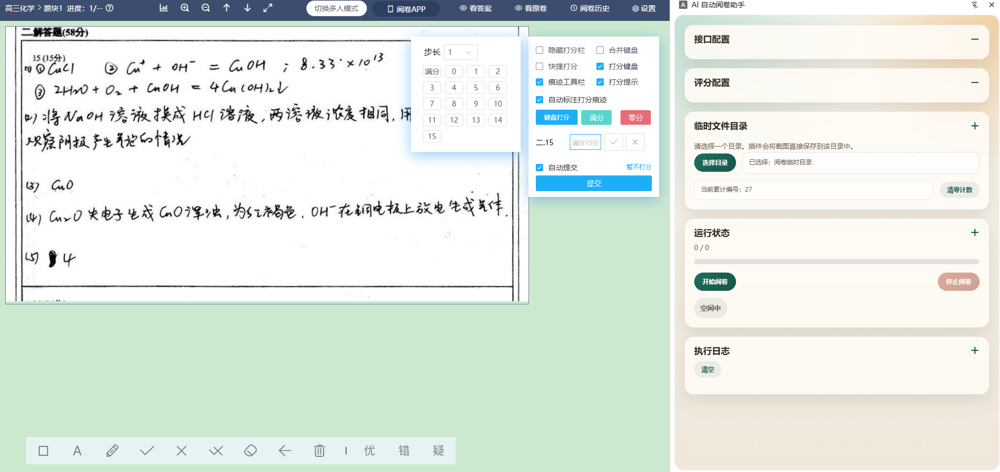
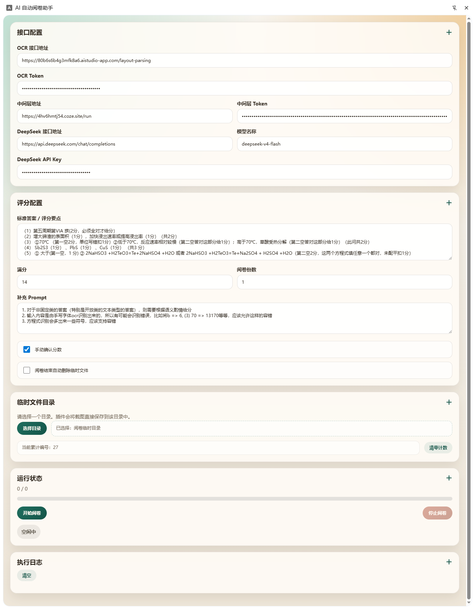
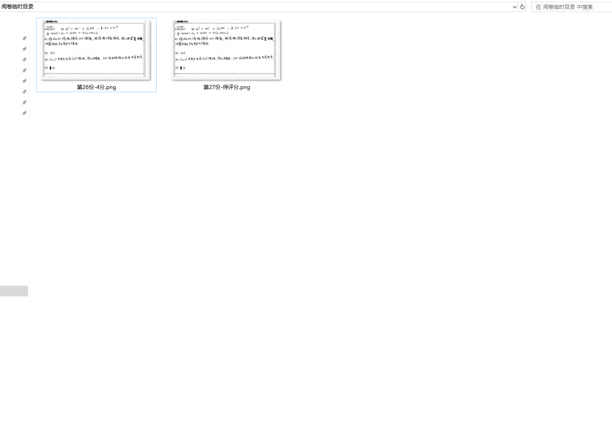

# AI 自动阅卷助手

一个基于 Chrome Manifest V3 的侧边栏插件，用于在阅卷页面中自动完成：

1. 定位 `#subjectmark_content_svg` 作答区域
2. 捕获当前标签页并裁剪目标区域
3. 保存截图到用户选择的本地目录
4. 调用 OCR 接口识别文本
5. 调用 DeepSeek 对识别结果评分
6. 回填 `.score-input`
7. 重命名截图为 `第n份-m分.png`
8. 自动点击 `.submit-button` 推进下一份

## 目录结构

```text
app-config.js
request-proxy.js
manifest.json
background.js
content.js
sidepanel.html
sidepanel.css
sidepanel.js
README.md
```

## 使用方式

1. 打开 Chrome，进入 `chrome://extensions`
2. 开启开发者模式
3. 选择“加载已解压的扩展程序”，指向当前目录
4. 点击插件图标打开侧边栏
5. 填写 OCR 与 DeepSeek 配置，输入标准答案 / 评分要点
6. 填写中间层地址与 Token
7. 选择一个本地目录作为临时截图目录
8. 在目标阅卷页面点击“开始阅卷”

## 关键假设

- OCR 请求默认走独立中间层转发：插件请求中间层，中间层再转发到飞桨 `layout-parsing` 接口，用于规避浏览器扩展 `Origin` 导致的 403。
- 飞桨 OCR 上游请求头使用 `Authorization: token xxx`，请求体使用 Base64 文件直传，截图按图片类型固定发送 `fileType: 1`。
- DeepSeek 接口按 OpenAI 兼容聊天补全格式工作。
- 评分页面存在以下选择器：
  - 作答区域：`#subjectmark_content_svg`
  - 分数输入框：`.score-input`
  - 提交按钮：`.submit-button`

## 已实现的增强项

- Side Panel 配置面板
- 独立中间层转发配置（地址 + Token）
- API Key 本地 AES-GCM 加密存储
- 目录句柄持久化（IndexedDB）
- 手动确认模式
- 进度条与执行日志
- 停止阅卷
- 阅卷完成后按需删除本次生成的截图文件

## 注意事项

- 当前 OCR 配置项已适配为 `OCR 接口地址 + OCR Token`，不再使用 `AppID / API Key / Secret Key`。
- 中间层默认配置可在 `app-config.js` 中维护，避免把代理实现细节硬编码到主流程。
- 如评分站点在 `chrome://`、扩展页或其他受限页面中，Chrome 内容脚本无法注入。
- 手动确认模式下，插件会在当前份回填分数后停止自动提交，以便人工审核。

## 界面演示

以下图片已补充到 `assets/` 目录，用于说明插件的使用场景和配置界面：

- `assets/使用场景.png`：展示插件在阅卷页面中的应用场景。
- `assets/全部配置.png`：展示侧边栏中的完整配置项，包括 OCR、DeepSeek、目录和手动确认设置。
- `assets/临时文件.png`：展示插件保存截图临时文件时的目录结构与命名规则。

### 示例







